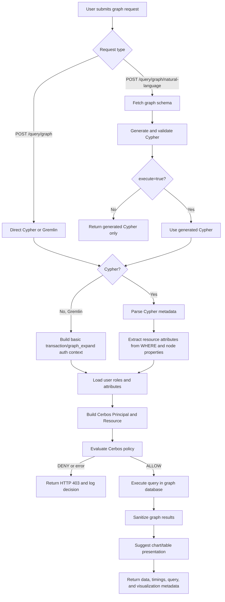

# Cypher Query Authorization Lifecycle

This document explains how a Cypher graph query moves through the policy registry: request intake, parsing, Cerbos authorization, approval or denial, and graph database execution. It is written for both technical readers who need implementation detail and product readers who need to understand what can be governed.

## Executive Summary

Cypher authorization is enforced before the graph database executes a query. The backend turns each query into a Cerbos resource with parsed metadata such as node labels, relationship types, traversal depth, query shape, team filters, region filters, PEP flags, and transaction thresholds. Cerbos evaluates that resource against the authenticated user, their roles, and their user attributes. Only allowed queries are sent to the configured graph execution engine.

The current implementation uses PuppyGraph, but the lifecycle applies to any Cypher-capable graph database or graph query service, including Neo4j, as long as the backend can retrieve schema context, execute Cypher, and normalize results.

Product implication: policies can express graph-aware controls, not just "can this user query the graph?" Controls can differentiate junior analysts, senior analysts, managers, teams, regions, clearance levels, sensitive node types, sensitive relationship types, and high-risk query filters.

Technical implication: the enforcement point is in FastAPI before execution. The parser is a regex metadata extractor, not a full Cypher compiler, so policy controls are only as strong as the metadata extracted and passed to Cerbos.

## Lifecycle Diagram



## Entry Points

There are two graph query paths:

| Endpoint | Purpose | Execution behavior |
|---|---|---|
| `POST /query/graph` | Execute direct Cypher or Gremlin | Always authorizes before execution |
| `POST /query/graph/natural-language` | Convert natural language to Cypher using the live graph schema | Returns generated Cypher when `execute=false`; authorizes and executes when `execute=true` |

For direct Cypher, the user supplies:

```json
{
  "type": "cypher",
  "query": "MATCH (c:Customer)-[:OWNS]->(a:Account) RETURN c.name, a.account_id LIMIT 10"
}
```

For natural language execution, the user supplies:

```json
{
  "query": "Show customers and their accounts",
  "execute": true
}
```

The natural language path first retrieves the graph schema, generates Cypher, validates labels/relationships/properties against the schema, and then uses the same authorization path as direct Cypher.

## Authentication Context

The backend authenticates the caller with a bearer token and loads the current `User` from the policy store database. It then loads:

| Context | Source | Used by Cerbos as |
|---|---|---|
| User ID | `users.id` | `Principal.id` |
| Email | `users.email` | `Principal.attr.email` |
| Roles | `user_roles` joined to `roles` | `Principal.roles` |
| Attributes | `user_attributes` | `Principal.attr.team`, `region`, `clearance_level`, `department` |

Current seeded AML users include junior analysts, senior analysts, a regular analyst, a high-clearance analyst, and a manager. These users are intentionally different across role, team, region, and clearance so policies can be tested end to end.

## Groups, Roles, and Attributes

The current implementation does not have a separate first-class "group" table or group claim in Cerbos. Group-like behavior is modeled in two ways:

| Concept | Current implementation | Examples |
|---|---|---|
| Roles | Cerbos `Principal.roles` from the database role assignments | `aml_analyst`, `aml_analyst_junior`, `aml_analyst_senior`, `aml_manager`, `admin` |
| Derived roles | Cerbos policy-defined role hierarchy | `aml_analyst_senior` derives from junior analyst roles; `aml_manager_full` derives from manager |
| Groups or cohorts | User attributes, not a separate group object | `team = Team A`, `region = US`, `department = AML` |
| Clearance | Numeric user attribute | `clearance_level = 1` through `5` |

Product wording should therefore use "roles and attributes" unless a separate group model is added later. If formal groups are required, the backend would need to add group membership to the auth model and pass it to Cerbos as either roles or principal attributes.

## Cypher Parsing

For Cypher requests, the backend calls `parse_cypher_query(query)` and `extract_resource_attributes(query)` from `policy-registry/backend/cypher_parser.py`.

The parser extracts structural metadata:

| Metadata | Example source | Example value |
|---|---|---|
| `node_labels` | `(c:Customer)-[:OWNS]->(a:Account)` | `["Customer", "Account"]` |
| `relationship_types` | `[:OWNS]`, `[:SENT_TXN]` | `["OWNS", "SENT_TXN"]` |
| `max_depth` | Number of relationships in the longest `MATCH` path | `2` |
| `has_aggregations` | `count(...)`, `sum(...)`, `collect(...)` | `true` |
| `query_pattern` | Single match, path variable, multiple match, `WITH`, `UNION` | `simple`, `path`, `multi_match`, `with_clause`, `union` |
| `path_variables` | `p = (c)-[:OWNS]->(a)` | `["p"]` |
| `has_where_clause` | `WHERE c.region = 'US'` | `true` |
| `has_order_by` | `ORDER BY c.risk_rating` | `true` |
| `has_limit` | `LIMIT 10` | `true` |
| `estimated_nodes` | Uses `LIMIT`, otherwise a rough node-pattern estimate | `10` |
| `estimated_edges` | Relationship pattern estimate | `20` |

The parser also extracts policy-relevant filters:

| Resource attribute | Extracted from | Used for |
|---|---|---|
| `risk_rating` | `WHERE c.risk_rating = 'high'` or `{risk_rating: 'high'}` | Risk-filtered access policies |
| `transaction_amount` | `WHERE t.amount = 100000` | Exact amount policies |
| `transaction_amount_min` | `WHERE t.amount > 100000` or `>=` | High-value transaction clearance |
| `transaction_amount_max` | `WHERE t.amount < 500000` or `<=` | Bounded transaction policies |
| `pep_flag` | `WHERE c.pep_flag = true` or `{pep_flag: true}` | PEP access clearance |
| `severity` | `WHERE a.severity = 'high'` | Alert severity policies |
| `status` | `WHERE case.status = 'open'` | Case or alert status policies |
| `customer_team` | `WHERE c.team = 'Team A'` or `{team: 'Team A'}` | Team-based ABAC |
| `customer_region` | `WHERE c.region = 'US'` or `{region: 'US'}` | Region-based ABAC |

Important limitation: this parser uses regular expressions. It is sufficient for common demo and controlled query shapes, but it does not provide full Cypher semantic analysis. Complex expressions, aliases, computed predicates, nested conditions, or alternative syntax may not produce the expected authorization metadata.

## Cerbos Request Shape

After parsing, the backend builds Cerbos attributes like this:

```json
{
  "query_type": "cypher",
  "query": "MATCH (c:Customer {team: 'Team A'}) RETURN c LIMIT 10",
  "node_labels": ["Customer"],
  "relationship_types": [],
  "max_depth": 0,
  "has_aggregations": false,
  "query_pattern": "simple",
  "path_variables": [],
  "has_where_clause": false,
  "has_order_by": false,
  "has_limit": true,
  "estimated_nodes": 10,
  "estimated_edges": 0,
  "customer_team": "Team A"
}
```

Then it calls Cerbos with:

| Cerbos field | Value |
|---|---|
| Resource kind | `cypher_query` |
| Resource ID | `graph-query` |
| Action | `execute` |
| Principal roles | Database roles for the current user |
| Principal attributes | Email, team, region, clearance level, department |
| Resource attributes | Query text plus parsed Cypher metadata |

The Cerbos resource policy is `cerbos/policies/resource_policies/cypher_query.yaml`. It imports derived roles from `cerbos/policies/derived_roles/graph_query_roles.yaml` and validates attributes with `cypher_query_resource.json` and `aml_principal.json`.

## What Policies Can Evaluate

The current policy set can evaluate the following dimensions.

### User And Principal Dimensions

| Dimension | Examples | Notes |
|---|---|---|
| User identity | `Principal.id`, `Principal.attr.email` | Available, but current graph rules mainly use roles and attributes |
| Roles | `admin`, `aml_analyst`, `aml_analyst_junior`, `aml_analyst_senior`, `aml_manager` | Primary RBAC input |
| Derived roles | `aml_analyst_senior`, `aml_manager_full` | Defined in Cerbos, not in application code |
| Team | `Team A`, `Team B` | Used for customer team matching |
| Region | `US`, `EU`, `APAC` | Used for customer region matching |
| Clearance level | `1` through `5` | Used for PEP and transaction threshold policies |
| Department | `AML`, `IT`, `Compliance` | Available for future policies |
| Active status | Schema supports `is_active`; auth rejects inactive users before policy | Not a main graph policy condition today |

### Query And Resource Dimensions

| Dimension | Examples | Current usage |
|---|---|---|
| Query type | `cypher`, `gremlin` | Cypher uses `cypher_query/execute`; Gremlin uses legacy `transaction/graph_expand` |
| Node labels | `Customer`, `Account`, `Transaction`, `Alert`, `Case`, `SAR` | Used to deny sensitive nodes and SAR access |
| Relationship types | `OWNS`, `SENT_TXN`, `FLAGS_CUSTOMER`, `FLAGS_ACCOUNT`, `FROM_ALERT` | Used to deny sensitive alert relationships |
| Traversal depth | `0`, `1`, `2`, `4` | Junior/base analysts limited to 2; seniors to 4 |
| Query pattern | `simple`, `path`, `multi_match`, `with_clause`, `union` | Parsed and available; not heavily used today |
| Aggregations | `count`, `sum`, `collect` | Parsed and available for future controls |
| Result bound | `LIMIT 10` | Parsed as `has_limit` and rough `estimated_nodes` |
| Customer team filter | `Team A`, `Team B` | Used for team ABAC |
| Customer region filter | `US`, `EU` | Used for region ABAC |
| PEP flag | `true`, `false` | Requires clearance >= 3 when true |
| Transaction amount threshold | `> 100000`, `> 500000` | Requires clearance >= 2 or >= 3 depending on threshold |
| Risk, severity, status | `high`, `open`, `closed` | Extracted and available for policy expansion |

## Policy Evaluation Order

The graph policy includes broad allow rules and explicit deny rules. Product readers can think of this as:

1. Admins and managers are allowed broadly.
2. Deny rules block sensitive cases before analyst allow rules can grant access.
3. Analyst allow rules grant access only within role-specific constraints.
4. ABAC rules compare user attributes to resource attributes extracted from the query.

Key current rules:

| Rule category | Behavior |
|---|---|
| Admin | `admin` can execute all Cypher queries |
| Manager | `aml_manager` and `aml_manager_full` can execute all Cypher queries |
| Junior analyst deny | Deny `Case`, `Alert`, and sensitive alert relationships |
| Analyst team deny | Deny customer queries when user team and query team are both present and different |
| Analyst region deny | Deny customer queries when user region and query region are both present and different |
| PEP deny | Deny PEP access when clearance is missing or below 3 |
| High-value transaction deny | Deny `> 100k` below clearance 2 and `> 500k` below clearance 3 |
| Junior allow | Allow max depth <= 2 and no `SAR` node |
| Senior allow | Allow max depth <= 4 and no `SAR` node |
| Base analyst allow | Allow max depth <= 2, no `SAR`, no `Case`/`Alert`, and no sensitive alert relationships |

On Cerbos errors, the client fails closed and returns a denial.

## Compound Policy Examples

Cerbos policies can be compound. In this project, "compound" means a decision can combine role membership, derived roles, parsed query structure, extracted query filters, and user attributes in the same authorization decision.

The main constraint is not Cerbos itself. The constraint is what the backend parser extracts from the Cypher query and passes as `R.attr.*`.

### RBAC And ABAC Together

A rule can require both a role and a matching user/query attribute. This supports product requirements like "AML analysts can query customers only for their own team."

```yaml
- actions: ["execute"]
  effect: EFFECT_ALLOW
  roles: ["aml_analyst", "aml_analyst_junior", "aml_analyst_senior"]
  condition:
    match:
      expr: |
        R.attr.node_labels.contains("Customer") &&
        (R.attr.customer_team == null || P.attr.team == null || P.attr.team == R.attr.customer_team)
```

Example query:

```cypher
MATCH (c:Customer {team: 'Team A'})
RETURN c.customer_id, c.name
LIMIT 10
```

The query parser extracts `node_labels = ["Customer"]` and `customer_team = "Team A"`. Cerbos compares that to `P.attr.team`.

### Multiple Query Conditions

A single rule can combine several parsed Cypher features. This supports requirements like "junior analysts can run shallow graph queries, but cannot touch SAR nodes or alert relationships."

```yaml
- actions: ["execute"]
  effect: EFFECT_ALLOW
  roles: ["aml_analyst"]
  condition:
    match:
      expr: |
        R.attr.max_depth <= 2 &&
        size(R.attr.node_labels.filter(l, l == "SAR")) == 0 &&
        size(R.attr.node_labels.filter(l, l == "Case")) == 0 &&
        size(R.attr.node_labels.filter(l, l == "Alert")) == 0 &&
        size(R.attr.relationship_types.filter(r, r == "FLAGS_CUSTOMER")) == 0 &&
        size(R.attr.relationship_types.filter(r, r == "FLAGS_ACCOUNT")) == 0 &&
        size(R.attr.relationship_types.filter(r, r == "FROM_ALERT")) == 0
```

Example query that would be denied for this role:

```cypher
MATCH (a:Alert)-[:FLAGS_CUSTOMER]->(c:Customer)
RETURN a.alert_id, c.customer_id
LIMIT 10
```

The parser extracts `node_labels = ["Alert", "Customer"]` and `relationship_types = ["FLAGS_CUSTOMER"]`, causing the compound condition to fail.

### Explicit Deny Plus Broader Allow

Policies can use explicit deny rules for sensitive cases, then broader allow rules for normal cases. This is useful when a product rule should override otherwise valid role access.

```yaml
- actions: ["execute"]
  effect: EFFECT_DENY
  roles: ["aml_analyst", "aml_analyst_junior", "aml_analyst_senior"]
  condition:
    match:
      expr: |
        R.attr.pep_flag == true &&
        (P.attr.clearance_level == null || P.attr.clearance_level < 3)
```

Example query:

```cypher
MATCH (c:Customer)
WHERE c.pep_flag = true
RETURN c.customer_id, c.name
LIMIT 10
```

Even if the user has an analyst role that can normally query customers, this deny rule blocks the query unless `P.attr.clearance_level >= 3`.

### Derived Role Chains

Cerbos derived roles can express hierarchy-like behavior in policy. In this project, graph query roles are defined separately from application code.

```yaml
derivedRoles:
  name: graph_query_roles
  definitions:
    - name: aml_analyst_junior
      parentRoles: ["aml_analyst"]
      condition:
        match:
          expr: "true"

    - name: aml_analyst_senior
      parentRoles: ["aml_analyst_junior"]
      condition:
        match:
          expr: "true"
```

Product interpretation: a senior analyst can be treated as a more capable analyst tier while still keeping the policy hierarchy in Cerbos instead of hard-coding it into endpoint logic.

### Cross-Attribute Comparisons

Rules can compare user attributes to resource attributes extracted from the query. This supports "same team" and "same region" policies.

```yaml
- actions: ["execute"]
  effect: EFFECT_DENY
  roles: ["aml_analyst", "aml_analyst_junior", "aml_analyst_senior"]
  condition:
    match:
      expr: |
        R.attr.customer_region != null &&
        size(string(R.attr.customer_region)) > 0 &&
        P.attr.region != null &&
        size(string(P.attr.region)) > 0 &&
        string(P.attr.region) != string(R.attr.customer_region)
```

Example query:

```cypher
MATCH (c:Customer {region: 'EU'})
RETURN c.customer_id, c.name
LIMIT 10
```

A user with `P.attr.region = "US"` is denied because the query asks for `R.attr.customer_region = "EU"`.

### Combined Product Rule

The policy model can express a compound rule like:

> A senior AML analyst may run Customer queries up to 4 hops, but not SAR nodes, only in their region, unless they are a manager, and only if clearance is high enough for PEP or high-value transaction filters.

That requirement is represented by several cooperating rules:

| Requirement | Policy mechanism |
|---|---|
| Senior AML analyst | `roles: ["aml_analyst_senior"]` and derived roles |
| Customer graph query | `R.attr.node_labels.contains("Customer")` |
| Up to 4 hops | `R.attr.max_depth <= 4` |
| No SAR nodes | `size(R.attr.node_labels.filter(l, l == "SAR")) == 0` |
| Same region | Compare `P.attr.region` to `R.attr.customer_region` |
| Manager exception | Separate broad allow for `aml_manager` |
| PEP clearance | Require `P.attr.clearance_level >= 3` when `R.attr.pep_flag == true` |
| High-value transaction clearance | Compare `P.attr.clearance_level` to `R.attr.transaction_amount_min` thresholds |

## Execution

When Cerbos allows a query, the backend sends it to the configured graph database adapter. In this repository, that adapter is `PuppyGraphClient.execute_cypher(query)`. A Neo4j-backed deployment would use the same authorization lifecycle, but replace the execution adapter with a Neo4j client while preserving the pre-execution Cerbos check.

The current PuppyGraph adapter prefers Bolt via the Neo4j driver and falls back to PuppyGraph HTTP execution only if the Neo4j driver is unavailable. Results are converted into JSON-safe structures so graph `Node`, `Relationship`, and `Path` objects can be returned to the UI.

The response includes:

| Field | Meaning |
|---|---|
| `success` | Execution succeeded |
| `data` | Graph database result rows and columns |
| `query_type` | Usually `cypher` |
| `execution_time_ms` | Graph database execution time |
| `sequence_metrics.cerbos_ms` | Time spent in Cerbos evaluation |
| `sequence_metrics.engine_ms` | Time spent in the graph database engine |
| `sequence_metrics.backend_ms` | Total backend time |
| `query` or `cypher` | Executed query |
| `chart_type`, `chart_subtype`, `echarts_option` | Optional visualization suggestion |

All allow and deny decisions are also logged into an in-memory authorization decision list for UI display.

## Examples

### Example 1: Junior Analyst Allowed For A Simple Customer Query

User:

```text
analyst.junior@pg-cerbos.com
roles: aml_analyst, aml_analyst_junior
team: Team A
region: US
clearance_level: 1
```

Query:

```cypher
MATCH (c:Customer {team: 'Team A', region: 'US'})
RETURN c.customer_id, c.name
LIMIT 10
```

Parsed attributes:

```json
{
  "node_labels": ["Customer"],
  "relationship_types": [],
  "max_depth": 0,
  "has_limit": true,
  "customer_team": "Team A",
  "customer_region": "US"
}
```

Decision: allow. The query is shallow, does not access restricted node labels or relationships, and the query team/region match the user.

### Example 2: Junior Analyst Denied For Case Access

User:

```text
analyst.junior@pg-cerbos.com
roles: aml_analyst, aml_analyst_junior
```

Query:

```cypher
MATCH (c:Case)
RETURN c.case_id, c.status
LIMIT 10
```

Parsed attributes:

```json
{
  "node_labels": ["Case"],
  "relationship_types": [],
  "max_depth": 0
}
```

Decision: deny. The junior analyst deny rule blocks `Case` and `Alert` nodes.

### Example 3: Junior Analyst Denied For Excessive Depth

Query:

```cypher
MATCH path = (c:Customer)-[:OWNS]->(a1:Account)-[:SENT_TXN]->(t:Transaction)-[:TO_ACCOUNT]->(a2:Account)
RETURN path
LIMIT 10
```

Parsed attributes:

```json
{
  "node_labels": ["Customer", "Account", "Transaction"],
  "relationship_types": ["OWNS", "SENT_TXN", "TO_ACCOUNT"],
  "max_depth": 3,
  "query_pattern": "path",
  "path_variables": ["path"]
}
```

Decision: deny for a junior analyst. Junior analysts are allowed only when `max_depth <= 2`.

### Example 4: Team ABAC Denial

User:

```text
analyst.junior@pg-cerbos.com
team: Team A
region: US
```

Query:

```cypher
MATCH (c:Customer {team: 'Team B'})
RETURN c.customer_id, c.name
LIMIT 10
```

Parsed attributes:

```json
{
  "node_labels": ["Customer"],
  "customer_team": "Team B"
}
```

Decision: deny. The user has `Team A`, the query asks for `Team B`, and the team mismatch deny rule applies.

### Example 5: PEP Clearance Denial

User:

```text
analyst.senior@pg-cerbos.com
roles: aml_analyst, aml_analyst_senior
clearance_level: 2
```

Query:

```cypher
MATCH (c:Customer)
WHERE c.pep_flag = true
RETURN c.customer_id, c.name
LIMIT 10
```

Parsed attributes:

```json
{
  "node_labels": ["Customer"],
  "pep_flag": true
}
```

Decision: deny. PEP customer access requires `clearance_level >= 3`.

### Example 6: High-Clearance Analyst Allowed For PEP Query

User:

```text
analyst.team_a.high@pg-cerbos.com
roles: aml_analyst, aml_analyst_senior
team: Team A
region: US
clearance_level: 3
```

Query:

```cypher
MATCH (c:Customer {team: 'Team A', region: 'US'})
WHERE c.pep_flag = true
RETURN c.customer_id, c.name
LIMIT 10
```

Decision: allow. The user has sufficient clearance and matches the query team and region.

### Example 7: High-Value Transaction Denial

User:

```text
analyst.junior@pg-cerbos.com
clearance_level: 1
```

Query:

```cypher
MATCH (t:Transaction)
WHERE t.amount > 500001
RETURN t.txn_id, t.amount
LIMIT 10
```

Parsed attributes:

```json
{
  "node_labels": ["Transaction"],
  "transaction_amount_min": 500001
}
```

Decision: deny for low clearance. The current policy requires elevated clearance for high-value transaction thresholds, with stricter handling above the $500k range.

### Example 8: Manager Allowed For Sensitive Query

User:

```text
manager@pg-cerbos.com
roles: aml_manager
clearance_level: 4
```

Query:

```cypher
MATCH (a:Alert)-[:FLAGS_CUSTOMER]->(c:Customer)<-[:FROM_ALERT]-(case:Case)
RETURN a.alert_id, c.customer_id, case.case_id
LIMIT 10
```

Decision: allow. Managers have broad Cypher execution access.

## Product Capabilities

The current implementation supports these product controls:

| Capability | Supported today? | Notes |
|---|---:|---|
| Role-based graph access | Yes | Admin, manager, junior, senior, base analyst |
| Sensitive node restrictions | Yes | `Case`, `Alert`, `SAR` |
| Sensitive relationship restrictions | Yes | `FLAGS_CUSTOMER`, `FLAGS_ACCOUNT`, `FROM_ALERT` |
| Traversal depth limits | Yes | Junior/base 2 hops, senior 4 hops |
| Team-based customer access | Yes | Based on parsed team filters |
| Region-based customer access | Yes | Based on parsed region filters |
| PEP clearance control | Yes | Requires clearance >= 3 |
| High-value transaction control | Yes | Based on parsed amount thresholds |
| Natural language governance | Yes | Generated Cypher is authorized before execution |
| Result visualization | Yes | Chart suggestion happens after allowed execution |
| Formal user groups | No | Model as roles or attributes unless a group model is added |
| Field-level graph redaction | No | Current graph path allows or denies whole query execution |
| Row-level result filtering after query | No | Enforcement is pre-execution authorization, not post-filtering |

## Operational Notes

Use these files when changing or reviewing behavior:

| File | Responsibility |
|---|---|
| `policy-registry/backend/app.py` | Request endpoints, user context loading, Cerbos call, execution |
| `policy-registry/backend/cypher_parser.py` | Query metadata and resource attribute extraction |
| `policy-registry/backend/cerbos_client.py` | Cerbos principal/resource construction |
| `policy-registry/backend/puppygraph_client.py` | Current graph database adapter: PuppyGraph execution and JSON-safe result conversion |
| `cerbos/policies/resource_policies/cypher_query.yaml` | Cypher authorization rules |
| `cerbos/policies/derived_roles/graph_query_roles.yaml` | Role hierarchy |
| `cerbos/policies/_schemas/cypher_query_resource.json` | Resource attribute schema |
| `cerbos/policies/_schemas/aml_principal.json` | Principal attribute schema |

## Design Considerations

The strongest current guarantees are role, depth, label, relationship type, team, region, PEP, and transaction-threshold checks for common Cypher query shapes.

Areas to improve for production hardening:

1. Replace regex extraction with a full Cypher parser or a normalized query planning layer.
2. Add explicit tests for every policy rule and every resource attribute extractor.
3. Add a formal group membership model if product requirements distinguish groups from roles and attributes.
4. Decide whether the product needs post-query filtering or redaction in addition to pre-query authorization.
5. Consider requiring `LIMIT` for non-manager graph queries to bound result size.
6. Persist authorization decisions if audit history must survive backend restarts.
